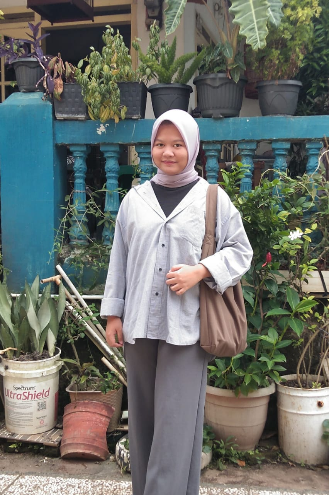

# Web-CV-Zahra-Kharisma-Sangha
<html>
<head>
    <title> UTS DESAIN APLIKASI WEB </title>
    
</head>
<h1  align=center > CURRICULUM VITAE</h1>
 
<body bgcolor="#996699">
<table border=0 cellpading =1 cellspacing=1>
<tr align=centre>

<table align = center >
	<tr>
		<td><h2><b>Data Personal :</b></h2></td>
	</tr>
    <tr>
    	<td colspan="2" align="center"></td>
    </tr>
	<tr>
		<td>Nama </td>
			<td>: Zahra Kharisma Sangha</td>
	</tr>
	<tr>
		<td>Alamat</td>
			<td>: Jl. Raden Saleh, Gg. Jati Baru 1, No. 40</td>
	</tr>
	<tr>
		<td>Tempat tanggal lahir</td>
			<td>: Bandar Lampung, 09-09-2003</td>
	</tr>
	<tr>
		<td>Jenis Kelamin</td>
			<td>: Perempuan</td>
	</tr>
	<tr>
		<td>Kewarganegaraan</td>
			<td>: Indonesia </td>
	</tr>
	<tr>
		<td>Agama </td>
			<td>: Islam </td>
	</tr>
	<tr>
		<td>Status</td>
			<td>: Belum Kawin</td>
	</tr>
	<tr>
		<td>No. Telepon</td>
			<td>: 083180459683</td>
	</tr>
	<tr>
		<td>Email </td>
			<td><a href=zahrakharismasangha@gmail.com>: zahrakharismasangha@gmail.com</a></td>

	</tr>

        <tr>
		<td><h2>Riwayat Pendidikan</h2></td>
        </tr>
	<tr><ol>
		<td><li>SDN 1 Gotong Royong</td>
            <td>: 2009 - 2015</li></td>
	</ol></tr>
    <tr><ol>
        <td><li>SMPN 25 Bandar Lampung</td>
            <td>: 2015 - 2018</li></td>
    </ol></tr>
    <tr><ol>
        <td><li>SMAN 2 Bandar Lampung</td>
            <td>: 2018 - 2021</li></td>
    </ol></tr>
	<tr><ol>
        <td><li> Universitas Teknokrat Indonesia</td>
		<td>: 2021 - 2024</li></td>
	</ol></tr>
    <tr> 
        <td>Prodi S1 Teknologi Informasi</td>
    </tr>
    <tr>
        <td><h2><b>Riwayat Organisasi</b></h2></td>
    </tr>
    <tr><ol>
        <td><li>Himpunan Mahasiswa Teknologi Informasi</td>
            <td>:Selama menjadi mahasiswa aktif</li></td>
    </ol></tr>
    
    <tr>
        <td><h3><b>Motto</b></h3></td>
            <td><h3><b>: Do the best, be the best and for the best</b></h3></td>
    </tr>
   
</table>

 
<h3 align=center>zahrakhrs, 2022</h3>
</body>
</html>
